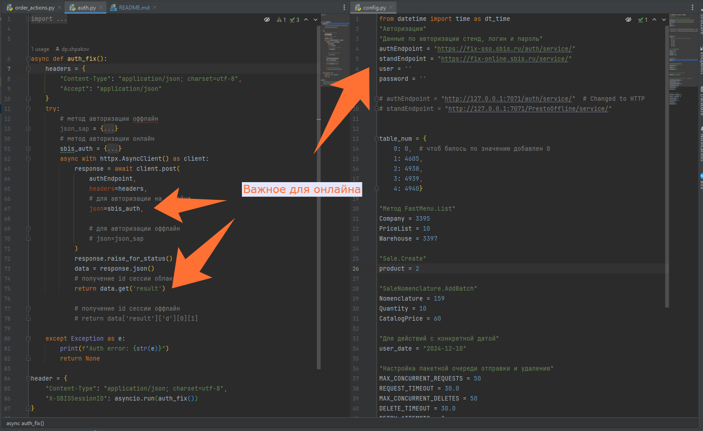
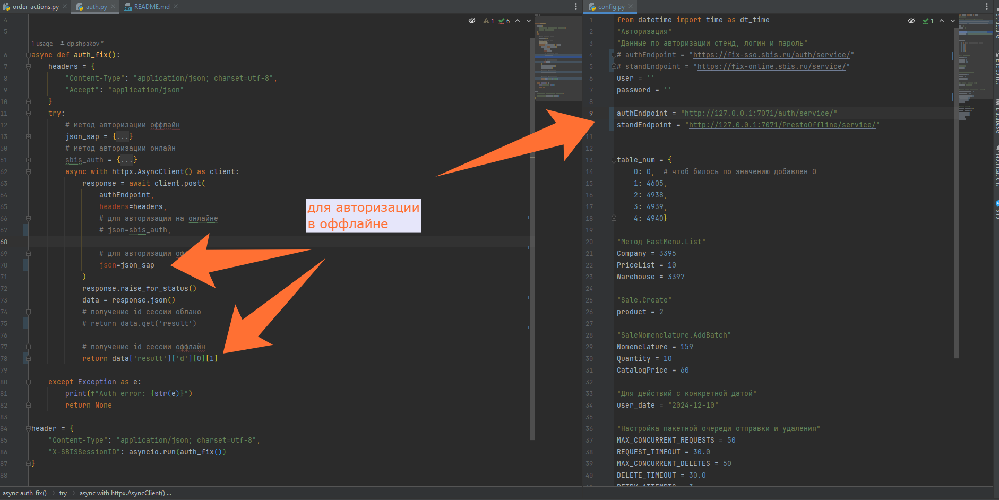
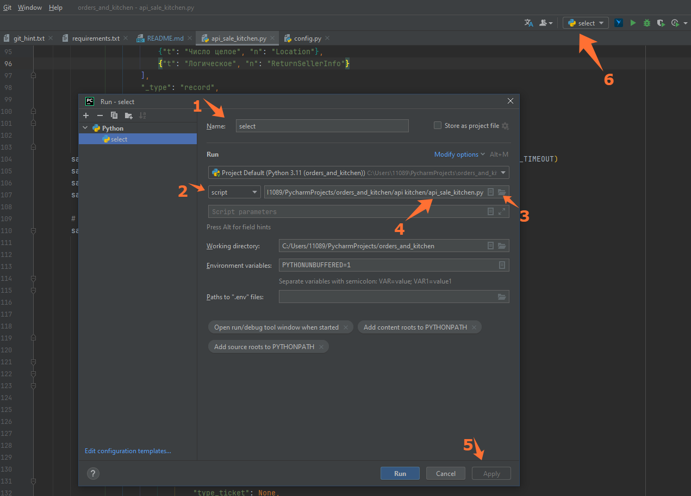

# Creating orders and working with them

### Описание
Проект разработан для внутреннего использования в компании. 
####
**Цель проекта** - реализовать своими силами нагрузочное тестирование для проверки системы на зависаниях и выявление узких мест.
При большом потоке данных. Проверка брокера на отказоустойсчивость при получении более 900 заказов при взаимодействии пользователя с приложением.
Возможность проверять первичную и регулярную синхронизацию с большими данными.
Дополнительно реализован шедулер для генерации указанного количества заказов с заданным интервалом времени. 
Позволяет симулировать работу заведений.
### ВАЖНО!
Функционал рассчитан только на работу с простой номенклатурой из прайса. Работоспособность программы не гарантировано
при передаче в параметрах списков из номенклатур, комплектов и др. данных.

#### Настройка config.py
Здесь хранятся все пользовательские настройки и параметры необходимые для запуска и работоспособности программы.
Все блоки разделены на методы из которых необходимо взять данные.
Для получения данных надо с включенным sbislogs выполнить ключевое действие. 
Заполнить поля **_user_** и **_password_**, при необходимости заменить ссылки на другие стенды по потребности.

###### Настройка подключения онлайн - оффлайн
Поскольку методы генерации и работы с заказами используются одинаковые и там и там, различие только в авторизации.
Перед началом работы необходимо будет закомментить одно и раскомментить другое, и также наоборот.  В файле config.py указать свой адрес **_localhost_** и **_порт_**.
 В файле auth.py провести аналогичную операцию внутри метода. Для удобства понимания оставлены комментарии над полями, какое за что отвечает.
 Для авторизации на _**онлайне**_ выбираем: 
ссылки по онлайну в config.py и раскомментировано поле **sbis_auth, return**, где получаем '_result_' в auth.py

 Для авторизации на _**оффлайне**_ выбираем: 
ссылки по оффлайну, онлайн комментим в config.py и раскомментировано поле **json=json_sap, и return**, где получаем по индексам значение поля "ИдСессии" в auth.py
В файле комментируем sbis_auth и return для онлайна.

И самое главное, запустить оффлайн с тем же пользователем, что и генератор запускается)
###### Получение данных из методов
1) **PrestoSale.List**   - вызывается при переходе в схему зала (ресторан).
 В table_num заполняем данные id столиков их берем из **_result_** по ключу Location. В table_num 0: 0 не удаляем,
сделано для удобства выбора столиков, т.к. в программировании счет начинается с 0. 
2) **FastMenu.List**   - вызывается при открытии столика.
Из params > Фильтр берем значения по ключам **___Company, PriceList, Warehouse___**
3) **Sale.Create**   - вызывается при создании новой продажи.
Из params > Properties берем значение по полю _**product**_
4) **SaleNomenclature.AddBatch**   - вызывается при добавлении номенклатуры в заказ. 
Добавляем в заказ ту номенклатуру, которая и будет генерироваться в заказах. Из **_result_** берем значения полей:
**_Nomenclature, CatalogPrice, Quantity_**. Для Quantity можно заменить на свое значение. Каждый заказ будет создаваться с этим количеством.

### Настройка пакетной очереди отправки и удаления
Значения выбраны оптимальные для исключения падений по таймауту 
_Лимит одновременных запросов в одной очереди _
MAX_CONCURRENT_REQUESTS = 50 
_Таймаут для каждого запроса _
REQUEST_TIMEOUT = 30.0 
_Лимит одновременных удалений в одной очереди _
MAX_CONCURRENT_DELETES = 50 
_Таймаут для каждого запроса _
DELETE_TIMEOUT = 30.0 
_Количество попыток повтора _
RETRY_ATTEMPTS = 3 
_Задержка между очередями в секундах _
QUEUE_DELAY = 1 

### Настройка шедулера
Время начала запуска генерации очереди заказов (чч, мм)  
WORK_START = dt_time(10, 0)  
Время завершения генерации очереди заданий (чч, мм)  
WORK_END = dt_time(19, 0)  
Интервал через какое время будет созданы новые заказы  
INTERVAL_MINUTES = 2  
Количество создаваемых заказов в одну итерацию с отправкой на готовку  
ORDERS_PER_BATCH = 10  
Максимальное количество попыток повтора запроса  
MAX_RETRIES = 3  
Столик по умолчанию для шедулера индекс списка  
DEFAULT_TABLE = 4  

## Запуск программы
Для удобной работы с программой необходимо использовать IDE.  
Для настройки конфига в ide pycharm необходимо выполнить команду Alt+Shift+F10 и нажать "Edit Configurations"  
В поле **Name** указать как будет называться конфигурация. В моем случае Select.    
В поле **script** нажать справа на папку и в дереве проекта выбрать исполняемый файл api_sale_kitchen.py. Применить.  
После этого действия в тулбаре отображается наш конфиг и можем запустить программу из любого места.
Запуск осуществляется по кнопке Run или горячими клавишами Shift+F10
